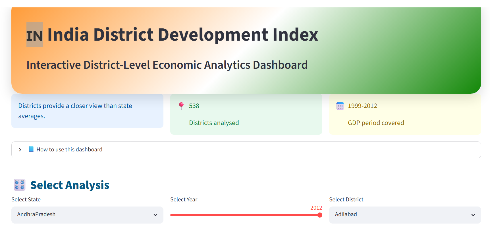
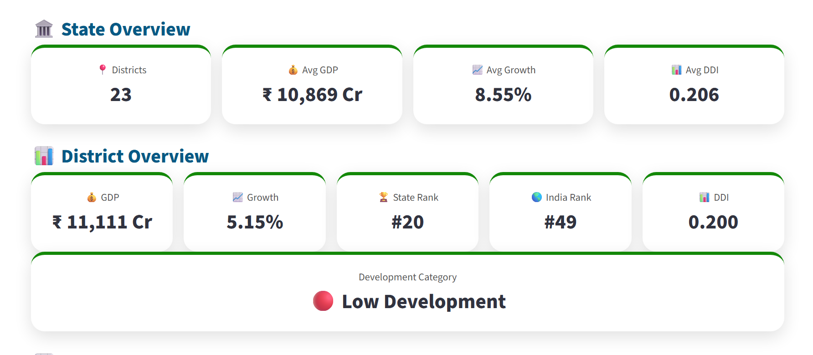
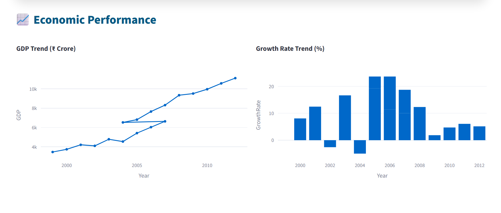
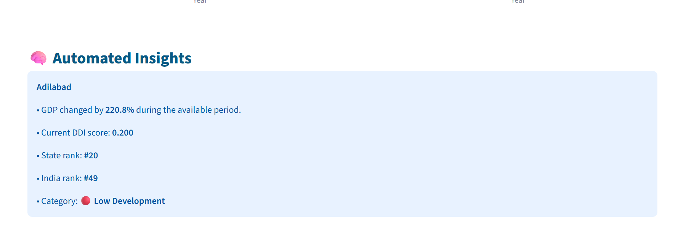
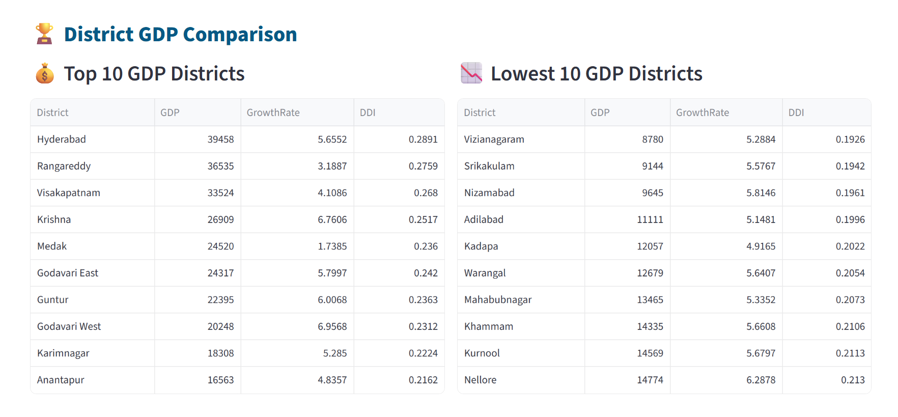
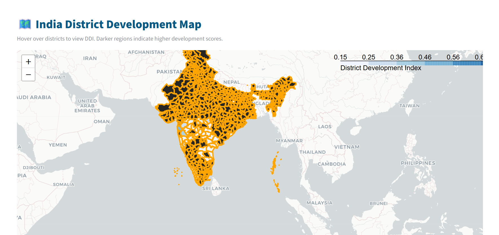

# 🇮🇳 India District Development Index (DDI) Dashboard

An interactive data analytics dashboard that evaluates economic development across Indian districts using GDP, growth rate, and a composite District Development Index (DDI).

The project converts raw district-level economic data into meaningful insights through data processing, feature engineering, ranking systems, interactive visualization, and geospatial analysis.

---

## 📌 Project Overview

Economic growth is not distributed equally across regions.

This project analyzes district-level economic performance across India and provides an interactive dashboard to explore:

- District-wise GDP performance
- Growth trends over years
- District development ranking
- State-level comparisons
- Geographic distribution of development

The dashboard helps users understand economic patterns at a more granular district level rather than only state-level averages.

---

# 🚀 Features

## 📊 Economic Analysis

- District-wise GDP analysis
- Year-wise GDP trends
- Growth rate visualization
- Comparison between districts


## 📈 District Development Index (DDI)

A composite development score calculated using:

- GDP performance
- Growth behaviour

The index provides a relative measure of district-level economic development.

Development categories:

🟢 High Development  
🟡 Medium Development  
🔴 Low Development  


---

## 🏆 Ranking System

The dashboard provides:

- District rank within selected state
- District rank across India
- Development category classification


---

## 🗺️ Interactive India Map

Includes:

- District-level choropleth map
- Development visualization
- Geographic comparison of districts


---

## 🧠 Automated Insights

The dashboard generates automatic summaries including:

- GDP change over time
- Current development status
- District ranking information
- Performance interpretation


---

# 🛠️ Tech Stack

## Programming Language

- Python


## Data Processing

- Pandas
- NumPy


## Machine Learning / Scaling

- Scikit-learn


## Visualization

- Plotly
- Folium


## Dashboard Framework

- Streamlit


---

# 📂 Project Structure


```
India-District-Development-Index/

│
├── app.py
├── requirements.txt
├── README.md
│
├── notebooks/
│   ├──data_pipeline.ipynb
│
├── data/
│
│   ├── raw/
│   │   └── Original datasets
│   ├── processed/
│   │   │
│   │   ├── district_development_index.csv
│   │   └── state_summary.csv
│   │
│   └── geojson/
│       └── india_district.geojson
│
└── assets/
    └── Images and resources

```

---

# ⚙️ Installation

Clone the repository:

```bash
git clone <https://github.com/MariaKhan28981>
```

Move into project directory:

```bash
cd India-District-Development-Index
```


Create virtual environment:

```bash
python -m venv venv
```


Activate environment:

### Windows

```bash
venv\Scripts\activate
```


Install dependencies:

```bash
pip install -r requirements.txt
```

---

# ▶️ Running the Dashboard

Run:

```bash
streamlit run app.py
```

The dashboard will open automatically in your browser.

---

# 🔄 Data Processing Workflow


```
Raw Data

   ↓

Data Cleaning

   ↓

Data Transformation

   ↓

Feature Engineering

   ↓

DDI Calculation

   ↓

District Ranking

   ↓

Interactive Dashboard

```

---

# 📐 DDI Calculation Methodology


The District Development Index is calculated using normalized economic indicators:


```
DDI =
(0.6 × GDP Score)
+
(0.4 × Growth Score)

```


Where:

GDP Score:
Relative economic size of a district.

Growth Score:
Relative yearly economic growth performance.


Higher DDI represents stronger relative development performance.

---

# 📊 Dashboard Sections

The dashboard includes:

- Introduction and project overview
- State selection
- District selection
- Year-wise analysis
- State overview statistics
- District metrics
- GDP and growth graphs
- Automated insights
- GDP ranking tables
- India development map


---
# 🎬 Dashnoard Snapshots
   

    

    
   
    
   
    
   
   


# Live Demo
  
  🔗 https://district-development-index-ddi-india-analytics-dashboard-pttsa.streamlit.app/


# 🎯 Future Improvements

Possible extensions:

- Add population-based GDP per capita
- Include literacy and infrastructure indicators
- Add more recent datasets
- Add prediction models
- Deploy as a public web application


---


# 👩‍💻 Author

Maria Khan
B.Tech Computer Engineering


---

# ⭐ Project Highlights

This project demonstrates:

- Data collection
- Data cleaning
- Data engineering
- Feature engineering
- Data visualization
- Dashboard development
- Geospatial analytics
